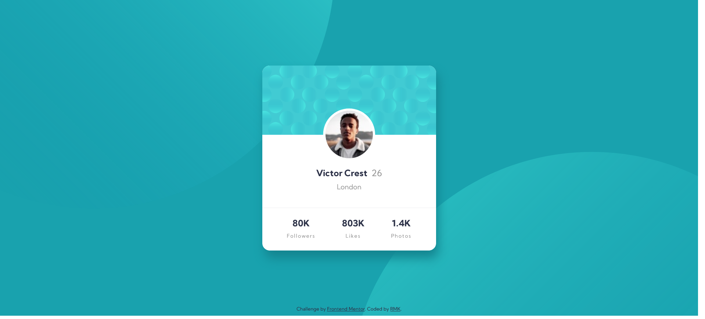

# Frontend Mentor - Profile card component solution

This is a solution to the [Profile card component challenge on Frontend Mentor](https://www.frontendmentor.io/challenges/profile-card-component-cfArpWshJ). Frontend Mentor challenges help you improve your coding skills by building realistic projects. 

## Table of contents

- [Overview](#overview)
  - [The challenge](#the-challenge)
  - [Screenshot](#screenshot)
  - [Links](#links)
- [My process](#my-process)
  - [Built with](#built-with)
  - [What I learned](#what-i-learned)
  - [Continued development](#continued-development)
  - [Useful resources](#useful-resources)
- [Author](#author)
- [Acknowledgments](#acknowledgments)

**Note: Delete this note and update the table of contents based on what sections you keep.**

## Overview

### The challenge

- Build out the project to the designs provided

### Screenshot

### Links

- Live Site URL: [Link to live solution](https://rmk-fem-profile-card.netlify.app/)

## My process

### Built with

- Semantic HTML5 markup
- Vanilla CSS3
- Flexbox

### What I learned

This was my first completed project using provided designs. I learned so much during this project, it's difficult to narrow it down - it showed me not only how much more I have to learn, but also how far I have come in only a few short months. 

As part of my workflow, I made notes on parts where I knew I would need to focus - for example how to position the profile image, the responsiveness, and positioning the background images. I hope to improve this notetaking on future projects, as it will certainly help my future self solve some seemingly basic issues

One thing that I'm particularly proud of, was the methodical approach I took to finding issues. As I was almost done, I realised that I hadn't been checking smaller screens and noticed issues with the card sticking to the edges, and/or horizontal scrolling. 
In order to find the problem, I used dev tools to make small changes and remove parts from the DOM - this proved to be a very time consuming, but incredibly valuable task.

### Continued development

As mentioned above, I will continue to develop my note taking - and try to keep it detailed in order to capture what I was thinking at the time, what I tried and what the solution was.

I plan to learn SASS and also implement naming methodologies to prepare myself for larger projects. I'll also be revisiting some CSS fundamentals in addition to  practicing how to read code better.

After receiving feedback on my solution from the Frontend Mentor community, I realise I need to focus much more on semantic HTML for accessibility, especially on use of h tags only for actual heading and not for style purposes. Additionally, being aware of and using ARIA.

### Useful resources

- [MDN docs - CSS positions](https://developer.mozilla.org/en-US/docs/Web/CSS/position) - I asked for help in the Frontend Mentor slack ground as I wasn't able to reduce space on the card. Another member pointed out the effect of position: relative and quoted this source. I'm very grateful that he shared this, it helped to clear up my understanding!

- [MDN docs - aria-hidden](https://developer.mozilla.org/en-US/docs/Web/Accessibility/ARIA/ARIA_Techniques/Using_the_aria-hidden_attribute) - Following feedback from Frontend Mentor community member, I read this document spefically related to aria-hidden, then expanded my search and found - [W3 WAI ARIA practices] (https://www.w3.org/TR/wai-aria-practices/) for further reading and reference in future.

## Author

- Frontend Mentor - [@Rachael](https://www.frontendmentor.io/profile/RMK-creative)
- Twitter - [@RMKcreative](https://twitter.com/RMKcreative)
